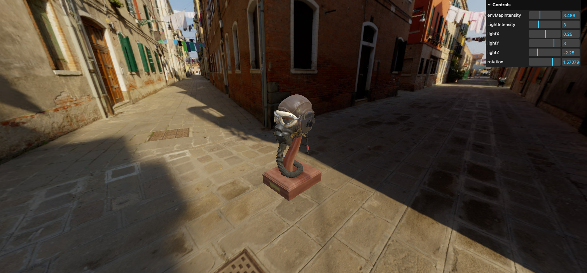

# Chapter 25 - Realistic Render 

## Introduction 
In this lesson, we will learn many techniques to improve how our model looks once rendered in Three.js. Note that some techniques may impact performance. 

## Key Learning Points 
- `MeshBasicMaterial` does not respond to light. Use `MeshStandardMaterial`
- Changing light intensities from default scale to a physically correct scale
- The benefit of this is if you import a model from blender with a light, result will be the same 
- The model imported is not compressed and thus do not need a draco loader to import 
- Add rotation of a model to gui panel 

### Environment mapping
- An environment map is like a background photo 
- It can be a 360 photo or 6 photos that compose a cube
- Use `CubeTextureLoader`

### Traverse
- `scene.traverse`
- Executes the callback on this object and all descendants(children)
- Using this function as we want to apply the directional light to the material composing background

### Encoding 
- `outputEncoding` property controls the output render encoding 
- Default encoding is `THREE.LinearEncoding` and we should use `THREE.sRGBEncoding`

### Tone Mapping
- High Dynamic Range (HDR) to Low Dynamic Range (LDR)

## Resources 
[sRGBEncoding](https://www.donmccurdy.com/2020/06/17/color-management-in-threejs/
https://medium.com/game-dev-daily/the-srgb-learning-curve-773b7f68cf7a) 

